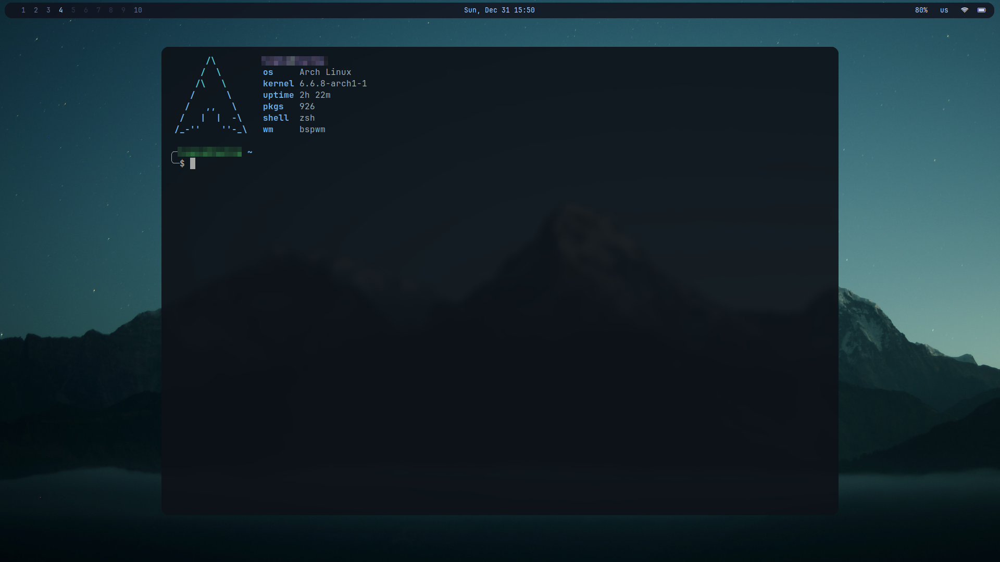
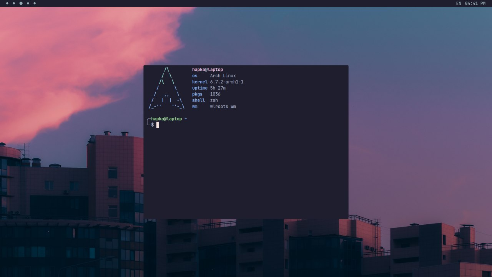
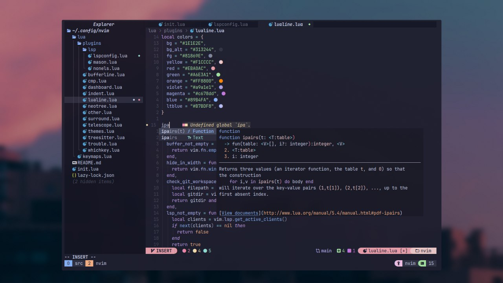

## Preview
### bspwm 

### hyprland 

## Dependencies
Ensure that the following packages are installed on your system.
Missing dependencies may lead to errors or incomplete configurations.

- [bspwm](https://github.com/baskerville/bspwm)
- [sxhkd](https://github.com/baskerville/sxhkd)
- [polybar](https://github.com/polybar/polybar)
- [picom](https://github.com/yshui/picom)
- [rofi](https://github.com/davatorium/rofi)
- [nitrogen](https://github.com/l3ib/nitrogen)
- [alacritty](https://github.com/alacritty/alacritty)
- [zsh](https://github.com/ohmyzsh/ohmyzsh/)
- [hyprland](https://github.com/hyprwm/Hyprland)
- [swww](https://github.com/LGFae/swww)
- [waybar](https://github.com/Alexays/Waybar)
- [dunst](https://github.com/dunst-project/dunst)

## Also check out my [neovim](https://github.com/kkk-petrov/neovim) configuration

## Disclaimer
Always review the configurations before applying them to your system. Make backups of existing configurations to avoid data loss.

