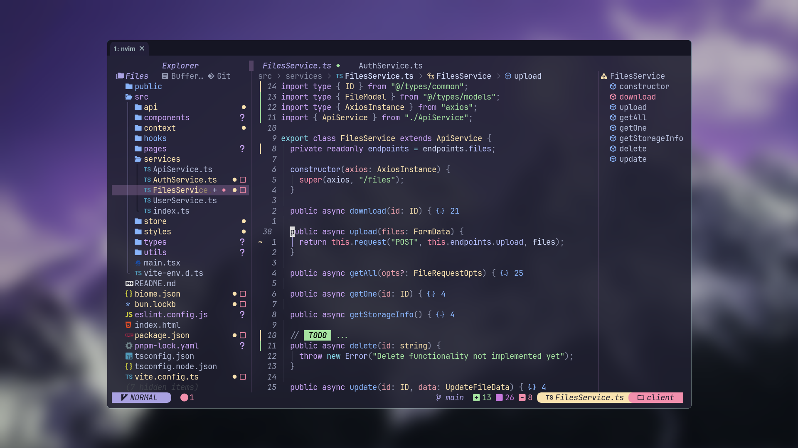

## Preview




## Installation
- Clone the repository
```sh
git clone git@github.com:kkk-petrov/dots.git ~/dots
```

>Note: If you clone the repository into a different directory, you need to update the SCRIPTS and ICONS variables in your .zshenv file to reflect the new path.


- Navigate to the cloned directory:
```sh
cd ~/dots
```


- Make the setup.sh script executable:
```sh
chmod +x setup.sh
```


- Run the script:
```sh
./setup.sh
```


## Disclaimer
Always review the configurations before applying them to your system. Make backups of existing configurations to avoid data loss.
