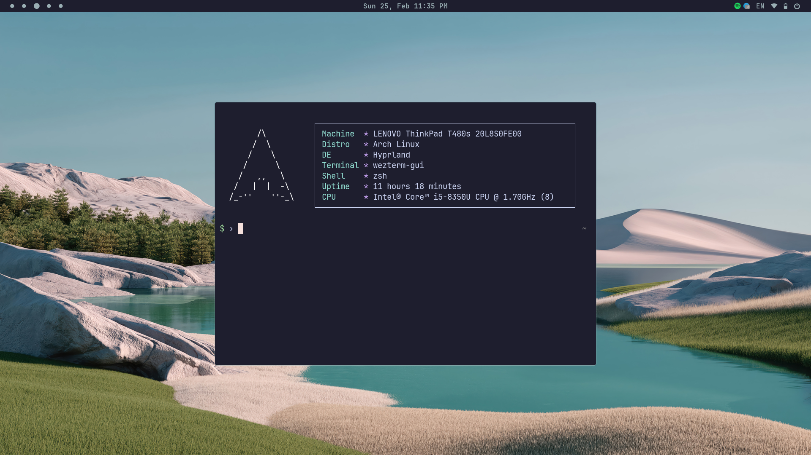

## Preview

## Dependencies
Ensure that the following packages are installed on your system.
Missing dependencies may lead to errors or incomplete configurations.

- [hyprland](https://github.com/hyprwm/Hyprland)
- [waybar](https://github.com/Alexays/Waybar)
- [wezterm](https://github.com/wez/wezterm)
- [zsh](https://github.com/ohmyzsh/ohmyzsh/)
- [dunst](https://github.com/dunst-project/dunst)
- [rofi](https://github.com/davatorium/rofi)
- [swww](https://github.com/LGFae/swww)

## Also check out my [neovim](https://github.com/kkk-petrov/neovim) configuration

## Disclaimer
Always review the configurations before applying them to your system. Make backups of existing configurations to avoid data loss.

