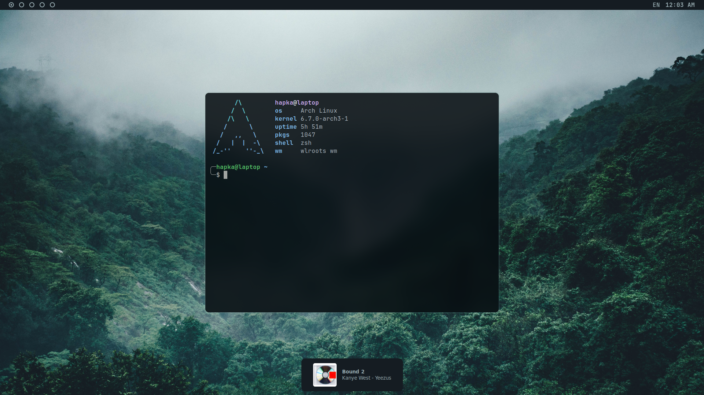

# Overview

My personal configurations for various tools and applications.

## Preview

## Dependencies

Ensure that the following packages are installed on your system.
Missing dependencies may lead to errors or incomplete configurations.

- [bspwm](https://github.com/baskerville/bspwm)
- [sxhkd](https://github.com/baskerville/sxhkd)
- [polybar](https://github.com/polybar/polybar)
- [picom](https://github.com/yshui/picom)
- [rofi](https://github.com/davatorium/rofi)
- [nitrogen](https://github.com/l3ib/nitrogen)
- [nvim](https://github.com/LazyVim/LazyVim)
- [alacritty](https://github.com/alacritty/alacritty)
- [zsh + ohmyzsh](https://github.com/ohmyzsh/ohmyzsh/)
- [pfetch](https://github.com/dylanaraps/pfetch)
- [hyprland](https://github.com/hyprwm/Hyprland)
- [hyprpaper](https://github.com/hyprwm/hyprpaper)
- [waybar](https://github.com/Alexays/Waybar)

Review and customize the configurations to ensure compatibility with your system and preferences.

## Disclaimer
Use these dotfiles at your own risk.
Always review the configurations before applying them to your system. Make backups of existing configurations to avoid data loss.
